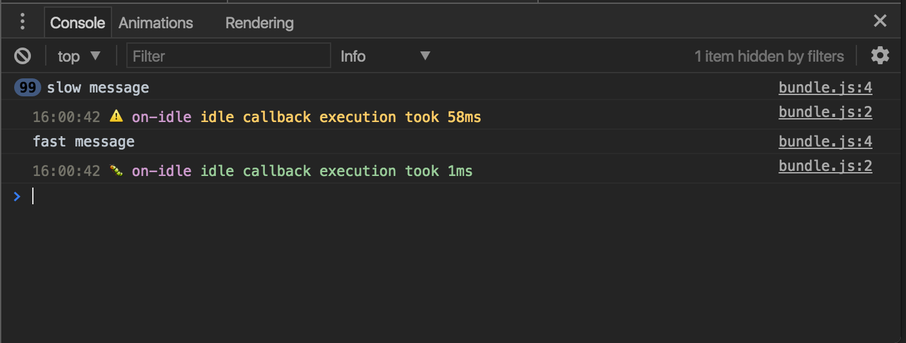

# on-idle [![stability][0]][1]
[![npm version][2]][3] [![build status][4]][5]
[![downloads][8]][9] [![js-standard-style][10]][11]

Safely detect when the browser is idle. Does nothing when run in Node.



## Usage
```js
var onIdle = require('on-idle')
var html = require('bel')

var cancel = onIdle(function () {
  var el = html`<h1>browser is idle</h1>`
  document.body.appendChild(el)
})

if (somethingHappens) {
  cancel()
}
```

## API
### `onIdle(callback, options)`
Call a function when the browser has spare time. Calls it on the next frame if
`window.requestIdleCallback` is not available. Does nothing in Node.

## License
[MIT](https://tldrlegal.com/license/mit-license)

[0]: https://img.shields.io/badge/stability-experimental-orange.svg?style=flat-square
[1]: https://nodejs.org/api/documentation.html#documentation_stability_index
[2]: https://img.shields.io/npm/v/on-idle.svg?style=flat-square
[3]: https://npmjs.org/package/on-idle
[4]: https://img.shields.io/travis/choojs/on-idle/master.svg?style=flat-square
[5]: https://travis-ci.org/choojs/on-idle
[6]: https://img.shields.io/codecov/c/github/choojs/on-idle/master.svg?style=flat-square
[7]: https://codecov.io/github/choojs/on-idle
[8]: http://img.shields.io/npm/dm/on-idle.svg?style=flat-square
[9]: https://npmjs.org/package/on-idle
[10]: https://img.shields.io/badge/code%20style-standard-brightgreen.svg?style=flat-square
[11]: https://github.com/feross/standard
